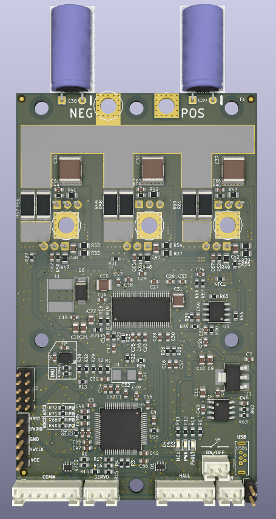
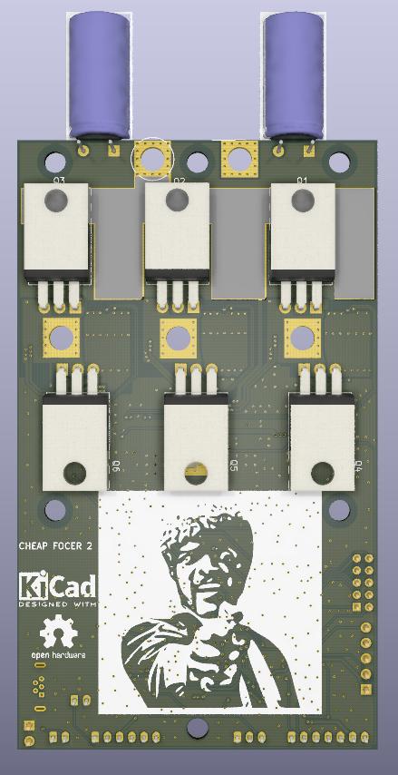

# Cheap FOCer 2 (v0.9)
Low-Cost(around $120 for 5 boards and components) Motor Controller based on the VESC 6

Front and Back:

 

Pin outs: 

## [Support Thread](https://forum.esk8.news/t/cheap-focer-2-open-source-low-cost-vesc-6-based-esc-prototyped-materials-arrived-for-test-batch/13631/1)

## [Ordering Guide](./orderingGuide/readme.md)

## Capabilities

- 35A continuous and 70A peak with good heat sinking. These are real values. Not marketing numbers

- Up to 50.4V(12s) safe operating voltage.  For 20s version take a look at [these FOCers](https://forum.esk8.news/t/some-new-focers-84v-vesc-6-based-controllers/1513). 

- Compatible with the VESC Tool for configuration

- Open source enclosure design to come

- “Living” LCSC BOM to come. BOM document to be continuously updated with compatible and stocked components from LCSC

## Advantages over VESC 6

- Significantly lower build and BOM cost

- TO-220 FETs allow for big heat sink attachment for better thermal performance

- 2-layer PCB that enables low-cost manufacturing from JLCPCB

- Designed with JLCPCB’s SMT assembly service in mind

- Added optional ON/OFF connector to turn off control circuitry when controller is not in use

- CAN connector changed to 2-pin to avoid improper connections that can cause damage

- ESD protected I/O

- Hardware open sourced

- Designed with direct meme integration

## Advantages over Cheap FOCer 1

- VESC 6 based instead of VESC 4.12

- Significantly improved layout to reduce current loops and facilitate low-noise operation of both the power stage and control circuitry for more stable operation

- Has IMU for balancing applications

- Lower profile

- Handles lower inductance motors much better

- All components on the top side except MOSFETs

- Addition of JST connectors to replace pin headers for Servo, CAN, COMM, ect.

- Addition of header for unused GPIO pins

- Micro USB

## Disadvantages (that I know of)

- Larger than original VESC 6. Cheap FOCer 2 is about 60mm x 100mm x 14mm without enclosure/heatsink

- Uses custom firmware that’s not currently supported in the VESC project. Will make firmware available on GitHub until Cheap FOCer 2 is added to and supported by the official VESC project.

## Warning
- The Cheap FOCer 2 has been bench tested but is still being field tested. Hardware or firmware flaws could still exist and affect user operation. 
- You are liable for any and all controllers built using this design. This product is intended for hobbyists and not intended for commercial use. 

## License
Cheap FOCer 2 is licensed under the Creative Commons Attribution-ShareAlike 4.0 International License. To view a copy of this license, visit http://creativecommons.org/licenses/by-sa/4.0/.
