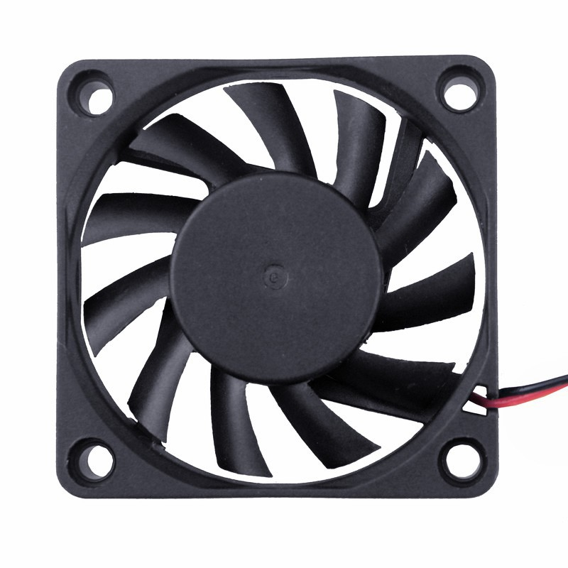

**[M3 x 6mm x 1mm nylon washers:]{.underline}** 5 per controller

Washers to be used between screw head and top side of PCB. Prevents rubbing between screw head and PCB surface.

{width="2.827777777777778in"
height="2.2027055993000877in"}

<https://www.aliexpress.com/item/33021883302.html?spm=a2g0o.productlist.0.0.2126290cxVS3M5&algo_pvid=82a621d5-060e-4077-9c64-22d559d691e7&algo_expid=82a621d5-060e-4077-9c64-22d559d691e7-1&btsid=0ab50f4415870809832364456e0a4e&ws_ab_test=searchweb0_0,searchweb201602_,searchweb201603_>

**[JST PH 2.0 Pigtails (optional):]{.underline}**

JST male connectors with wires included. Makes for convenient and quick setup of controller with external accessories.

{width="2.6777777777777776in"
height="2.6777777777777776in"}

<https://www.aliexpress.com/item/32733307616.html?spm=a2g0s.9042311.0.0.7a894c4dYDsoaK>

**[60mm 5v Fan (optional):]{.underline}**

Fan that can screw onto recommended heatsink fins. Provides extra cooling and is recommended if space allows and/or if high currents are used in operation. Powered from 5V supply of controller.

 {width="3438888888888889in" height="3.438888888888889in"}

<https://www.aliexpress.com/item/32571979071.html?spm=a2g0s.9042311.0.0.7a894c4dYDsoaK>
