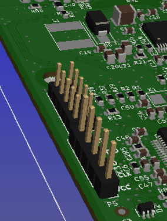

# Parts List
1. PCB with basic parts placed and soldered from PCB manufacture.  Follow [this guide](../orderingGuide/readme.md). 

1. Soldering iron
    * https://www.amazon.com/X-Tronic-3020-XTS-Digital-Display-Soldering/dp/B01DGZFSNE
    * special tips? 

1. Solder

1. Heat shrink
    * For the PCB: 
    * for other wires(motor bullet connectors)

1. these things:

1. heat sink stuffs
    * Spacers
    * bults
    * nuts
    * thermal pad

1. Wire and cables and connectors
    * Battery wire(xt connector)
    * motor wires(5.5mm bullet connectors)
    * jst males with wires

1. on/off switch
## Optional Parts
1.  [reflow station with soldering iron](https://www.amazon.com/Flexzion-Digital-Soldering-Station-Desoldering/dp/B0154G4A28)

1. bluetooth module

1. multimeter

1. solder wick

1. flux

1. magnifier/microscope

1. helping hands

1. remote recommendations

1. case
    * link to 3d printable one