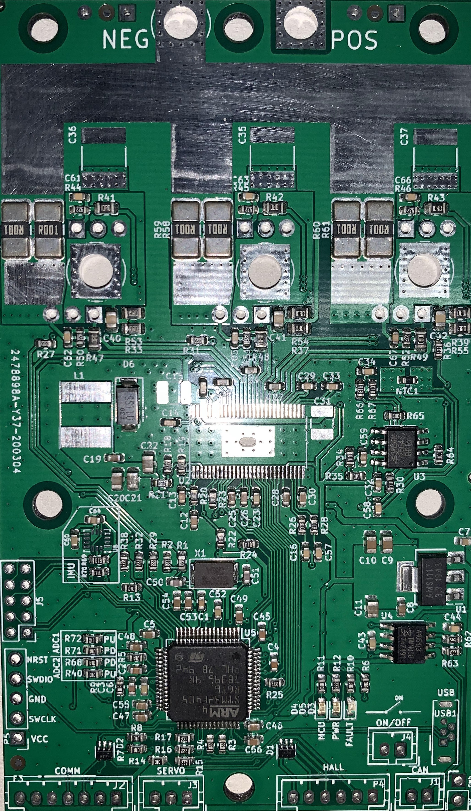
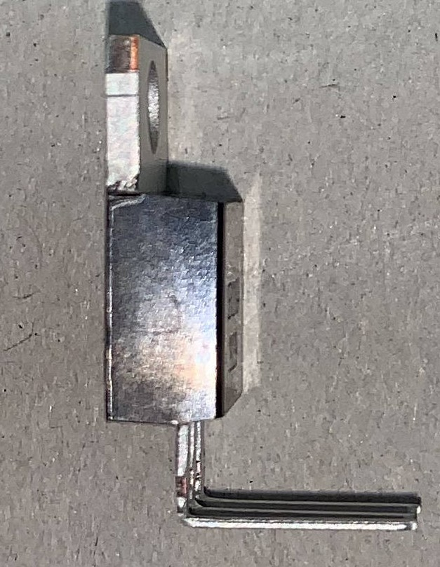
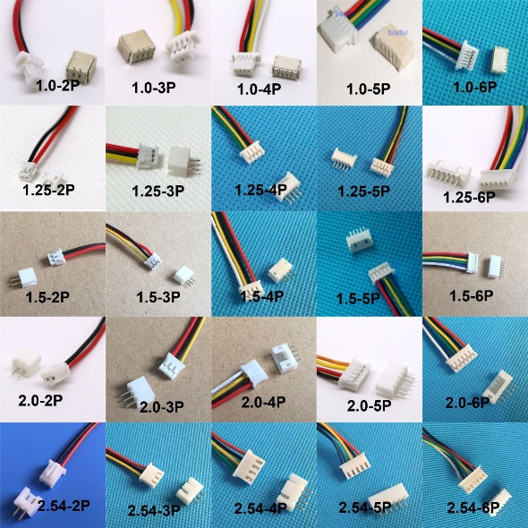
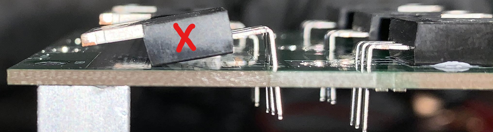
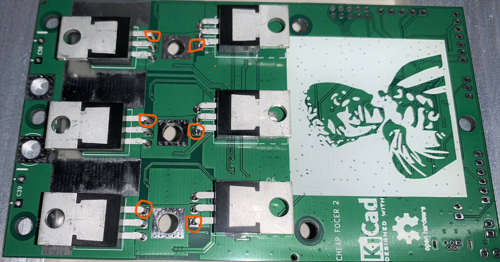
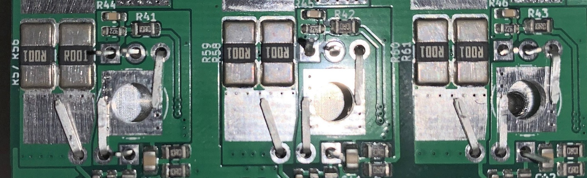
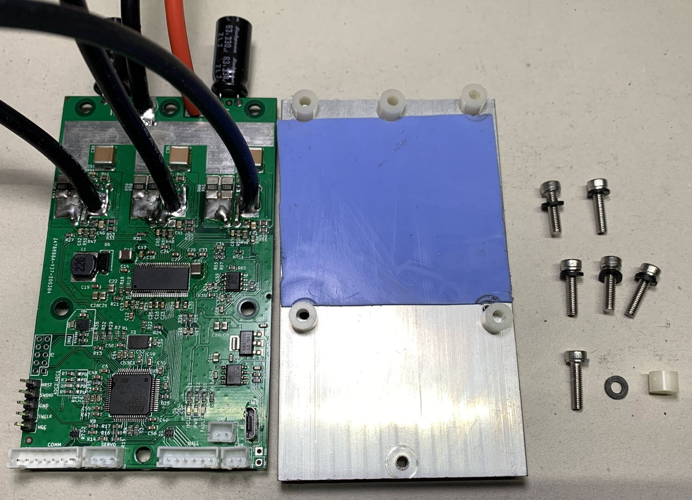

# Assembly Guide
The following guide explains correct procedures on how to assemble the Cheap FOCer 2 (CFOC2) and mount it to a flat heat sink surface. Please pay close attention to details else you will risk damaging the controller in assembly or causing damage later in operation. This is not time for "TLDR".

## Prerequisites
* Follow the [Ordering Guide](../orderingGuide) and receive  SMD assembled PCB
* Have all reequired [Parts](partsList.md)

## What your board should look like:

This is what your PCB should look like after the CFOC2 is the following example was created and partially assembled by JLCPCB. Note the DRV8301 is absent on the board due to lack of stock at the time this was ordered. It is recommended that JLCPCB provide and assemble the DRV8301 when ppssible.

Figure x. heatsink(left) and CFOC2 PCB(right)

Figure x. PCB temporarily fastened to heatsink surface

Use a fresh CFOC2 PCB to act as a drill pattern for the mounting holes in your heatsink. Align and temporarily fasten the PCB to the heatsink. The images above are an example of this using the recommended heatsink.

Drill and tap the 6 mounting holes for M3 screws. I recommend drilling the holes with a 2.5mm drill bit and then tapping the threads. If you do not have a tap and die set, you can *carefully* tap the threads by forcing one of the M3 screws through the holes. Turn the screw slowly and use some oil to help. If done too carelessly, the M3 screw could break off in the hole.

Figure x. TO-220 MOSFET w/ 90 degree bent legs

Bend all MOSFET legs at a 90-degree angle as shown in the figure above. Bend at the location just before the legs widen. Ideally a tool is used secure the body of the MOSFET and also to bend all the legs at once as per the guidance given in the "Lead Bending" section of [this document](http://www.aosmd.com/res/application_notes/package/AN101_TO220_Guidelines.pdf).

Figure x. Thermal Paste Applied to Exposed Pads

Locate the exposed pads on the backside of the PCB and apply a small amount of thermal paste. This ensures good thermal coupling of the NTC resistor that is responsible for measuring the case temperature of the MOSFETs during operation.

Figure x. MOSFETs Positioned on Back of PCB

Place all MOSFETs in the location and orientation as depicted in figure x above.

Figure x. Correct placement with MOSFET body is flush against PCB.

Figure x. Incorrect placement with MOSFET body not Flush with PCB

It is imperative that all MOSFETs be placed and held flush to the PCB surface. Failure to do so will cause a misalignment with the heatsink surface and cause potentially damage to the PCB.

Figure x. Initial MOSFET solder location

Figure x. Pressure applied to MOSFET

At this time solder the MOSFET legs that go through the square pad as highlighted in figure x. This will tack down the MOSFET into place during the next steps. Do not solder all of the legs yet.

It is advised to apply pressure to the MOSFET in order to ensure it stays flush to the PCB during soldering. Double check all MOSFETs after soldering to verify that the MOSFET bodies are flush to the PCB.

Figure x. MOSFET Legs Bent into Proper Position

Flip PCB over and bend the relevant MOSFET legs into their positions as shown in figure x above. Note that not all legs get bent. Bending the legs like this will add copper to the high-current portions of the PCB which helps handle the current.

Figure x. Legs Soldered from the Top

Solder all legs to their respective locations and pads. Add excess solder to the leg bent toward the larger current sense resistors. This adds conductive material and thermal mass to help handle the high current.

Do not add excess solder to the legs close to the large circular hole. This hole will be where the motor phase cable will be soldered later. Trim excess leg material from legs that were not bent.

Make sure that no solder bridges exist between legs.

Figure x. MOSFET Legs Soldered from Bottom

Flip PCB over and solder MOSFET legs from the bottom side. Soldering from both top and bottom ensures both good conductivity and mechanical security.

It is advised to apply excess solder to the thinner portions of the legs up to the point to where the legs widen. This adds more conductive material to the MOSFET legs where it is needed. Be sure to not create solder bridges between MOSFET legs.

Figure x. Fully assembled CFOC2 PCB(left) next to prepared heatsink(middle) and fastening hardware(right)

Now solder all remaining components to include cables to the PCB. Be sure to trim excess motor and DC power cable ends on the bottom of the PCB so that there is not risk of the cables being bridged to the heatsink.

Prepare the fastening hardware and a 60mm x 51mm portion of 1mm thick thermal pad as seen in the image above.

Make sure there is not any thermal pad being pinched between the nylon spacers in the heatsink. This will cause a misalignment in spacing which could cause excess stress to the PCB later.

Carefully tighten machine screws in the same manor as tightening lug nuts on a tire. Start with the middle screws on the top and bottom. Tighten until just barely snug and then do the same to the other screws. Do not fully tighten until all screws have had some amount of tightening and there is a relatively even amount of pressure on the PCB from all mounting points. When done, there should be no air gaps in between the nylon spacers and pcb/heatsink and there should be no airgaps between the MOSFET tabs and the thermal pad.

It is now time to power on the controller to conduct a quick test. It is preferable to conduct this initial power up with a current-limited power supply set to 100mA. When powered on, the controller should only draw as much roughly 70mA. If a current-limited power supply is not available, then powering up through an anti-spark connector is second best. The blue LED should illuminate if power is successfully flowing through the controller.

The controller is now ready to be programed. Please follow [this guide](https://electric-skateboard.builders/t/vesc-boot-loader-installation-tutorial/32103?source_topic_id=52813) to install the bootloader and CFOC2 firmware located in the firmware folder of the repository files.

# Coming soon
In the meantime get ready for your boards to arrive by making sure you have the tools you need in the [parts list](./partsList.md).

[How to solder tiny things](https://www.overclockers.com/how-to-solder-tiny-things/)
[youtube](https://youtu.be/b9FC9fAlfQE)
