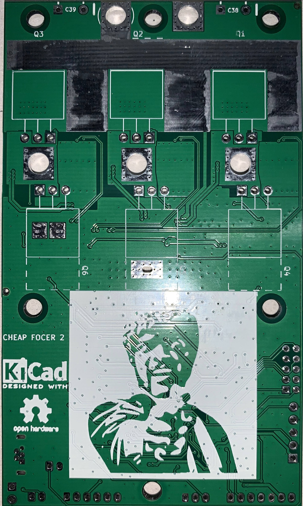

# Assembly Guide

The following guide explains correct procedures on how to assemble the Cheap FOCer 2(CFOC2).  This includes mounting a flat heat sink. Please **pay close attention** to the details in this guide or else risk damaging the controller during assembly or later during operation. **This is not time for "TLDR"**.

## Prerequisites

* Follow the [Ordering Guide](../ordering) and receive mostly SMD assembled PCB
* Obtain all required [Parts](partsList.md)
* Learn how to solder tiny things [reading style](https://www.overclockers.com/how-to-solder-tiny-things/)
or [video style](https://youtu.be/b9FC9fAlfQE)

## What your board should look like

Take a look at the front and back of the SMD assembled images below:
 
 This is what your PCB should look like after the CFOC2 is mostly SMD assembled by JLCPCB.  Note the DRV8301 is absent on the board due to lack of stock. It is recommended that JLCPCB provide and assemble the DRV8301 when possible.  Otherwise, you will have to do something like [this](https://youtu.be/k5N07ByY6Hc?t=399) to put it on.

## Tapping Heat Sink

1. Grab your [heat sink and CFOC2 PCB](images/heatSinkAndPCB.jpeg)

1. Temporarily fasten PCB to heat sink like this:
    

1. Mark the center of the 6 mounting holes on the heat sink with a marker or a hammer and something sharp like a nail to [make a center hole punch](https://www.youtube.com/watch?v=r5vngxToqi4)
1. [Drill and tap](https://www.youtube.com/watch?v=LuqliWT1k5A) the 6 mounting holes for M3 screws. Drill the holes with a 2.5mm drill bit and then tap the threads. If you do not have a tap, you can *carefully* tap the threads by forcing one of the steel M3 screws through the softer aluminum holes then backing out when there is resistance. Clean the screw/tap after backing out.  Turn the screw/tap slowly and use some oil to help. If done too carelessly, the M3 screw/tap could break off in the hole.  If you have a grinder you can also try [this](https://www.youtube.com/watch?v=7Ewu6VOrgU8)

## MOSFETs

1. Bend all MOSFET legs at a 90-degree angle as shown in the figure below. Bend at the location just before the legs widen. Ideally a tool is used secure the body of the MOSFET and also to bend all the legs at once as per the guidance given in the "Lead Bending" section of [this document](http://www.aosmd.com/res/application_notes/package/AN101_TO220_Guidelines.pdf).
    

1. Locate the exposed pads on the backside of the PCB and apply a small amount of **thermal paste**. This ensures good thermal coupling of the NTC resistor that is responsible for measuring the temperature of the MOSFETs during operation.
    

1. Place all MOSFETs in the location and orientation as shown below:
    

1. Make sure the MOSFETs are placed flat against the board like this:
    
    Not this:
    

    It is imperative that all MOSFETs be placed and held flush to the PCB surface. Failure to do so will cause a misalignment with the heat sink surface and cause damage to the PCB.

1. While holding down the MOSFET, solder the MOSFET legs that go through the square pad as shown below.  This will tack down the MOSFET into place during the next steps. Do not solder all of the legs yet.  It is advised to apply pressure to the MOSFET in order to ensure it stays flush to the PCB during soldering. Double check all MOSFETs after soldering to verify that the MOSFET bodies are flush to the PCB.
    
    

1. Flip PCB over and bend the relevant MOSFET legs into their positions as shown below. Note that not all legs get bent. Bending the legs like this will add copper to the high-current portions of the PCB which helps handle the current.
    

1. Solder all legs to their respective locations and pads on the top of the PCB. Add excess solder to the leg bent toward the larger current sense resistors(shown in the picture below in yellow). This adds conductive material and thermal mass to help handle the high current.

    Do not add excess solder to the legs close to the large circular hole(shown in the picture below in pink). This hole will be where the motor phase cable will be soldered later. Trim excess leg material from legs that were not bent.

    Make sure that no solder bridges exist between legs(shown in the picture below in pink).
    

1. Flip PCB over and solder MOSFET legs from the bottom side. Soldering from both top and bottom ensures both good conductivity and mechanical security.

    It is advised to apply excess solder to the thinner portions of the legs up to the point to where the legs widen. This adds more conductive material to the MOSFET legs where it is needed. Be sure to not create solder bridges between MOSFET legs.
    

## Solder All Remaining Components, Wires and Connectors

All [diodes](images/diodPol.png) should be taken care of by JLCPCB. The only other polarized components are the [electrolytic caps](images/capPol.jpg). The square PCB marking is positive and the circle is for negative as shown below:

If JLCPCB was out of stock for a polarized component please see the silkscreen marking on the PCB in white showing correct orientation for each polarized components.  Examples include:

* Semi-complete white rectangle silkscreen marking around diode. The absent side of the rectangle marks the Anode(negative). The other side is the Cathode(positive) as shown below:

    

* Same for LEDs since they too are diodes.

    

* Electrolytic caps can vary in how they’re marked but this one has a white line by the negative terminal:
  
    

If you have any other questions regarding part placement and polarity please see the fully assembled image below.  If all else fails open the `Cheap FOCer 2 60mm.pro` file in the `source` folder with [KiCAD](https://www.kicad-pcb.org/) as shown [here](images/kiCad.gif).

If you still have questions feel free to open a [github issue](https://github.com/shamansystems/Cheap-FOCer-2/issues).

## Mounting the Heat Sink

1. Trim excess motor and DC power cable ends on the bottom of the PCB so that there is not risk of the cables being shorting to the heat sink.  

1. Cut your thermal pad to 60mm x 51mm

1. Assemble the fastening hardware, PCB, thermal pad and heat sink as shown in the image below.

    Make sure the thermal pad isn't being pinched between the nylon spacers in the heat sink. This will cause a misalignment in spacing which could cause excess stress to the PCB.

    Apply a small dab of thread lock to the bottoms of each screw.  Carefully tighten screws in the same manor as tightening lug nuts on a tire. Start with the middle screws on the top and bottom. Tighten until just barely snug and then do the same to the other screws. Do not fully tighten until all screws have had some amount of tightening and there is a relatively even amount of pressure on the PCB from all mounting points. There should be no air gaps between the nylon spacers, pcb or heat sink.  Also check to make sure there are no air gaps between the MOSFET tabs and the thermal pad as shown below:
    

## Power on and Cross Your Fingers

It is now time to power on the controller to conduct a quick test. It is preferable to conduct this initial power up with a current-limited power supply set to 100mA or a cheap 100mA power adapter.  When powered on, the controller should only draw as much roughly 70mA. If a current-limited power supply or 100mA power adapter is not available, then powering up through an anti-spark connector is second best. The blue LED should illuminate if power is successfully flowing through the controller.

## Celebrate and Flash the VESC Bootloader

The controller is now ready to be programed. Please follow [this guide](https://electric-skateboard.builders/t/vesc-boot-loader-installation-tutorial/32103?source_topic_id=52813) to install the bootloader and CFOC2 [firmware](../../firmware/latest) located in the firmware folder of the repository files.  Use these pins for flashing the bootloader with the st-link:

