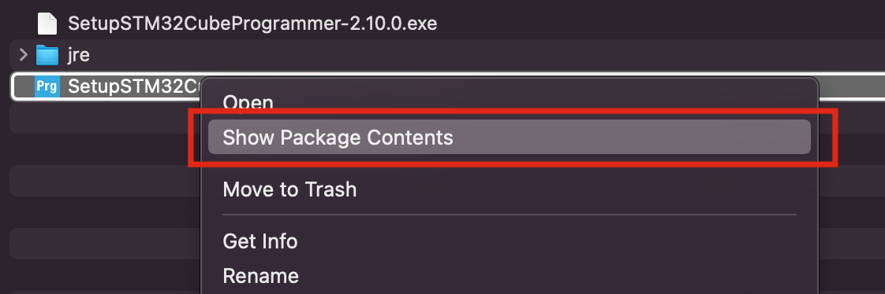
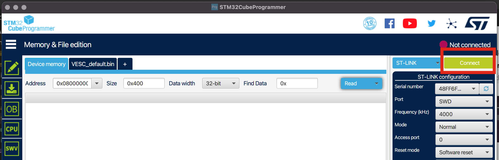
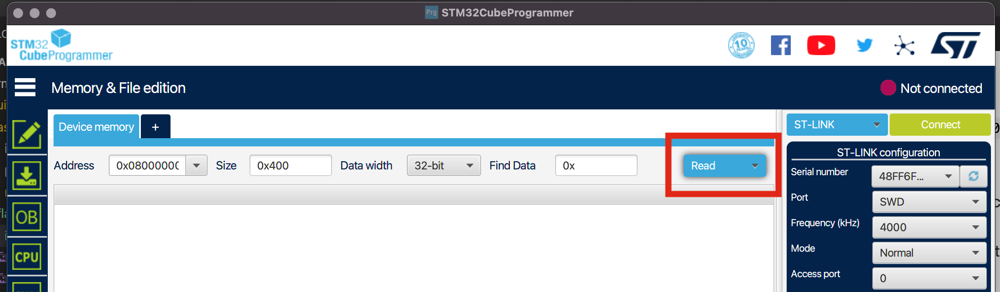
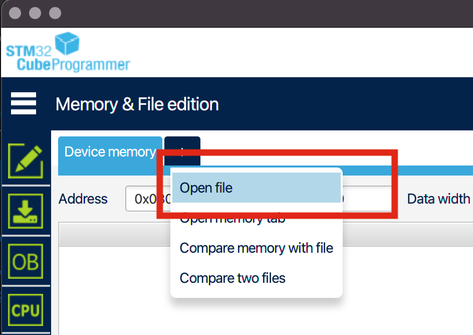
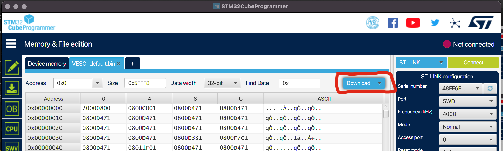
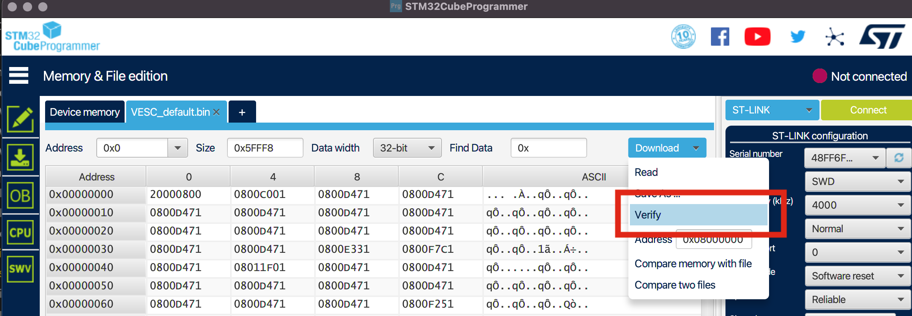

# Flashing

## Parts

* st-link
* [Pin Headers](../assembly/partsList.md#pin-headers-aliexpresshttpswwwaliexpresscomitem4000909558952html)

## Instructions

* Works on Mac, Windows and Linux
* Get [STM32CubeProgrammer](https://www.st.com/content/my_st_com/en/products/development-tools/software-development-tools/stm32-software-development-tools/stm32-programmers/stm32cubeprog.license=1647743703635.product=STM32CubePrg-Mac.version=2.10.0.html#get-software)
* Install it
  * **Mac** users need to extract the zip file then right click the `SetupSTM32CubeProgrammer-2.10.0.app` file and click `Show Package Contents` as shown below:
    * 
  * Next, open the `Contents` folder
  * Next, open the `MacOs` folder
  * Finally, open the `SetupSTM32CubeProgrammer-2_10_0_macos` file to run the setup
* Open the app
* Plug your USB programmer into your focer
  * VCC=3.3v
  * The other names of the pins match the programmer's pin names
  * No need to plug focer into your big battery just USB power is coo
* Plug your USB programmer into your computer
* Click `connect`:
  * 
* Click `read`:
  * 
* Click `+`:
* Click 'Open file':
  * 
* Select [this](./../../firmware/latest/BLDC_4_ChibiOS.bin) file
* Click `Download`:
  * 
* Click `verify`:
  * 
* Verify that there are no errors
* If there are no errors
  * Click the disconnect button
  * Unplug the st-link
  * Reboot the controller
* Done 🎉
