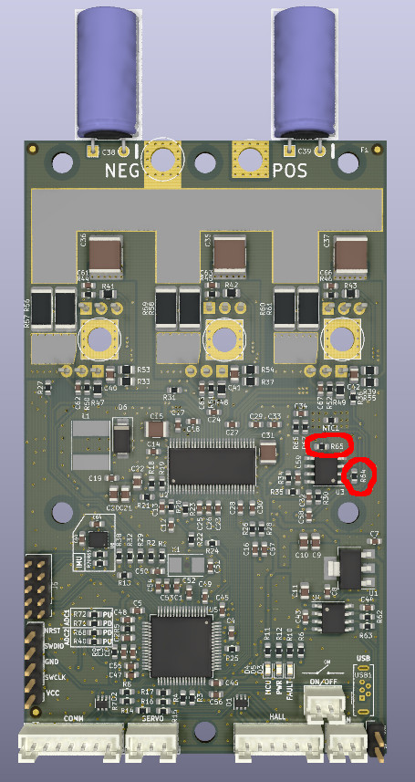

# Upgrade hardware from 0.9 to be 1.0 compatible
The changes from beta 0.9 to 1.0 are mostly hardware only, however there is one hardware change that required a software modification. 
This makes 1.0 firmware incompatible with 0.9 hardware. 

Thankfully this change can be done to existing 0.9 hardware boards. 
This will not make your board into a 1.0 board, however it will make your board 1.0 compatible. 

1.0 compatible boards have the following advantages:
1. You can use 1.0 firmware which is available in the main bldc repo and VESC Tool. 
1. It will fix the DRV error locking issue where DRV faults require a power cycle (you can still get a single DRV fault, but it wont require a power cycle).  

## How to upgrade!

Replace resistors R64 & R65 with 10k ohm resistors. Easy peasy!
- ***Resistory Details:*** 10kΩ ±1% 0.1W ±100ppm/℃ 0603 Chip Resistor
- ***LCSC Part #:*** [C25804](https://lcsc.com/product-detail/Chip-Resistor-Surface-Mount_UNI-ROYAL-Uniroyal-Elec-0603WAF1002T5E_C25804.html)

