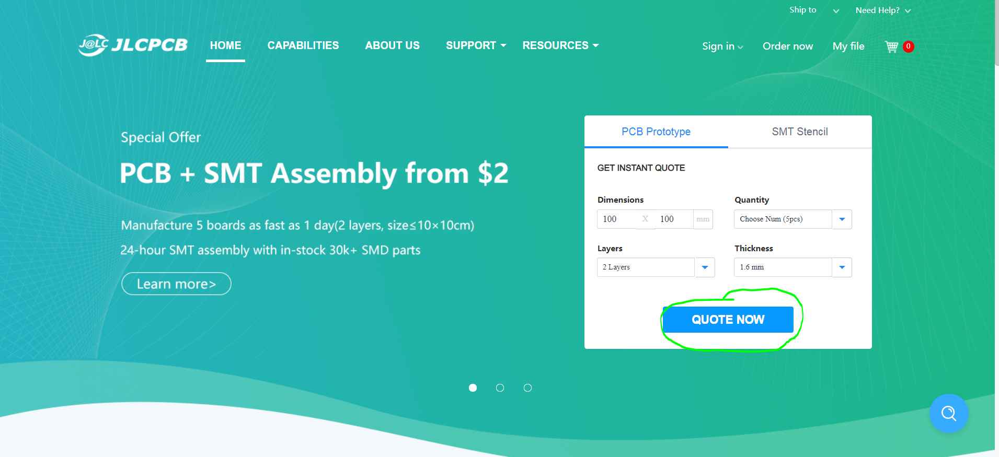
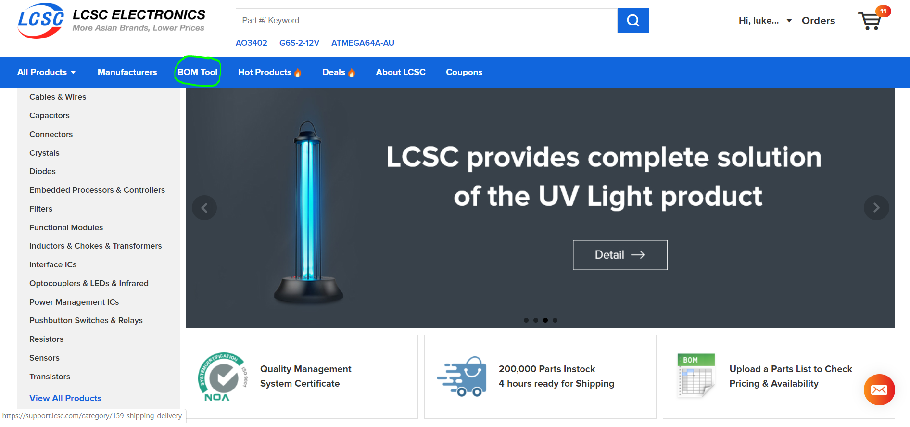

<u>**JLCPCB and LCSC Ordering Guide**</u>

1. Clone or [download](./archive/master.zip) the Cheap FOCer 2 repository and have the files available.

1. [Create an account](https://passport.easyeda.com/register) with JLCPCB.com. This account will also carry over to LCSC.com since they are the same company.

1. Navigate to JLCPCB.com and select the `QUOTE NOW` button from the home page. 

1. Click the `Add your gerber file` button. Find the JLCPCB and LCSC folder and select the [Cheap FOCer 2 60mm.zip](../gerber.zip) file. 

You should now see the CFOC2 front and back in the preview as shown above.

There are a few properties that you can customize if you want. The PCB quantity (the amount you want made), thickness, color, and surface finish are all I recommend adjusting to preference. Note that certain choices of these options will affect pricing. By default, the cheapest options are already selected.

1.  Select the toggle button to enable SMT Assembly.

2.  Select the “Assemble top side” option.

3.  Select how many boards you want assembled.

4.  Select the “confirm” button to continue.

1.  Click the “Add BOM File” and select the <u>JLCPCB BOM Cheap FOCer 2.xlsx</u> file in the JLCPCB and LCSC folder.

2.  Click the “Add CPL File” and select the <u>JLCPCB SMT POS Cheap FOCer 2.csv</u> in the JLCPCB and LCSC folder.

3.  Click “Next” to continue

You will now see the parts selected by JLCPCB based on the BOM that was uploaded. This list of parts includes every possible component available by JLCPCB to be assemble onto the Cheap FOCer 2\. Note that this includes certain “Extended Parts” such as the DRV8301 or any of the 100v rated components.

The only parts that you should see as “No part selected” are the (10uF, 100V) caps, the 22uH inductor, the BMI160 IMU, and the (4.7uF, 100V) caps. These components plus the MOSFETs must be acquired and assembled external to JLCPCB. Ordering these remainder components from LCSC.com will be covered later in this guide.

Click “Next to continue”

<u>**Warning:**</u> You will have to solder the BMI160 IMU yourself. This is a leadless component which requires a reflow station to solder. This part is only necessary for balancing applications like the onewheel or electric unicycles.

<u>**Warning:**</u> JLCPCB will often run out of stock on certain components. There is a chance you may have to find an alternative component with the same footprint and properties.

You should now see a preview of the parts placement on the CFOC2\. The placement of the DRV8301 and a few other multi-pin components will appear wrongly placed. <u>**This is ok.** </u>JLCPCB will correct this later in what they call a “DFM review”. I have had no issues in letting JLCPCB handle the correction of component placement in all of my many orders.

Scroll down and you will see a list of Unselected Parts. If all parts were available based on this guide so far, then the LCSC BOM later in this guide covers the remainder of the parts. If you excluded certain parts on your own or if JLCPCB was out of stock of something, then I advise selecting the “Download Unselected Parts List”. This will then be a list of what you still need to acquire external to JLCPCB.

Next click “Save to Cart” and proceed through the checkout process. If you’ve made it this far then congratulations! The hardest part is over and we will now proceed to ordering the remainder of the components from LCSC.com.

<u>**LCSC Ordering Guide**</u>

Go to LCSC.com, login, and select the “BOM Tool”

Click “select a file” and find the <u>**LCSC BOM Cheap FOCer 2.xlsx**</u> in the JLCPCB and LCSC folder.

There should now be a list that has loaded on your screen. You will have to manually select the column header for each column from the drop-down menus. Simply select the same name you see in row 1 for that column. If there is no matching name then leave it blank and the BOM Tool will figure it out. I have done column 1 in the image above.

Click “Next” to continue.

You should now see a page showing the parts that LCSC has chosen to fit the parts described in the BOM that was uploaded. They should be the same exact parts as described in the BOM unless LCSC happens to be out of stock of a component. Scroll through the list to verify that all parts are present and accounted for. Notice that certain components, like the inductor, have a minimum order quantity of 5\. This is common.

**Note that quantities of parts in this list are for only 1 CFOC2\. Please scale up the quantities per amount of CFOC2 PCBs you have ordered from JLCPCB. Note that the CFOC2 only requires 1x 22uH inductor despite the minimum order quantity of 5 seen in the image above.**

**If anything is out of stock, then you will have to find an alternative. This will most likely happen to the MOSFETs at some point. Please choose a MOSFET with similar properties as the one from the BOM. Do the same for any other out of stock component by choosing something with the closest properties of the original component from the BOM.**

**Alternative MOSFETs:**

1.  **NCEP60T20**

2.  **SE80160GA20**

After settling on the quantities you want, please add items to your cart and proceed with the checkout process.