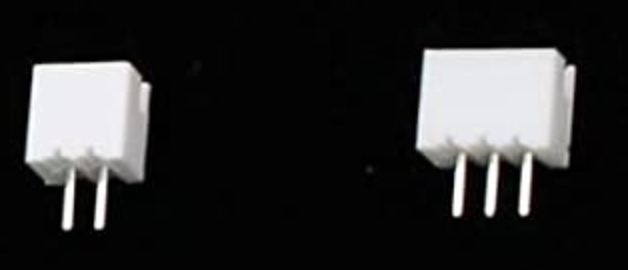

# List Of Components That Go Out Of Stock And Alternative Sources

## JST-PH(b2b,b3b,b6b,b7b) connectors
Be sure to get JST-PH not JST-XHP because the pin spacing is different. They look like this: 
### Alternative Sources
* https://www.aliexpress.com/item/32733307616.html?spm=a2g0s.9042311.0.0.7a894c4dYDsoaK
* https://www.amazon.com/Pieces-JST-PH-Connector-Female-Header/dp/B07P82QFXD/ref=sr_1_4?dchild=1&keywords=JST-PH&qid=1587274019&sr=8-4
* https://www.ebay.com/sch/m.html?_ssn=chendongsheng1969&_from=R40&_sacat=0&_nkw=JST-PH&_sop=15
    - fast shipping
    - wires already connected to males
    - asked if they can create an ad just for us with the exact parts we need.  